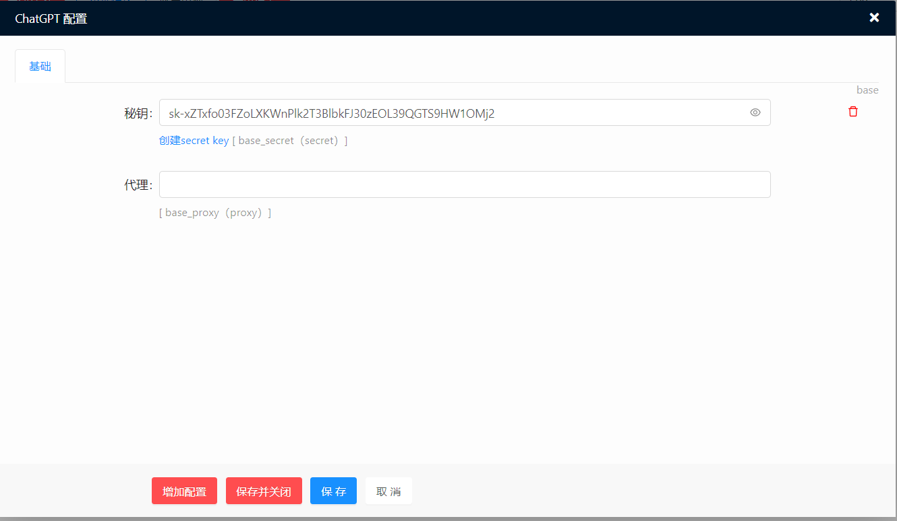

基于ChatGPT3.5 API的聊天应用，前端uniapp，后端YiAdmin。

## 聊天

## 编辑文本

## 作图

## 安装说明
1. 该模块是基于 `YiAdmin`，请先安装 `YiAdmin`
2. 下载后压缩为 `zip` 文件，进入`管理后台`——`模块管理` 离线安装即可。
3. 前端基于 `uniapp`，位于 `uniapp` 目录下。
4. `uniapp/common/config.js` 修改 `baseUrl` 为你的域名。
5. `管理后台`——`模块管理`——`ChatGPT`配置填写秘钥即可。

